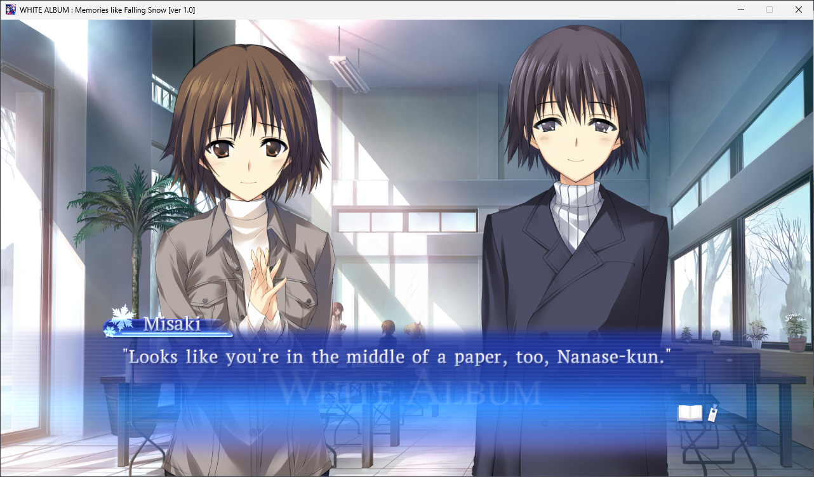

# White Album Restoration Patch 0.1
Delocalizes some content in White Album (2023 PC version), namely:

- Restoring honorifics (-kun, -san, etc.) along with first/last names used
- Removing Miss, Mr., etc.
- Replacing "Older Lady" with "Senpai"
- Replacing "doll" with Rina-chan

Hopefully that's all that needs to be delocalized!

**Note:** This patch is largely untested. Use at your own discretion!

## How to apply
- Download the [xdelta file](wa_honorifics.xdelta) and apply to your **Data/Game/ENG/Script.sdat** file using Delta Patcher. For example, `C:\Program Files (x86)\Steam\steamapps\common\WHITE ALBUM\Data\Game\ENG\Script.sdat`

